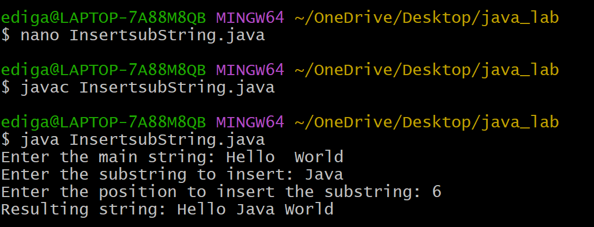

# Additional_exp1
## Title:To Insert a substring into a main string
## SOURCE CODE:
``` java
   import java.util.Scanner;
 class Insertsubstring {
     public static void main(String[] args) {
        Scanner sc = new Scanner(System.in);
        // Input main string
        System.out.print("Enter the main string: ");
        String mainString = sc.nextLine();
        // Input substring
        System.out.print("Enter the substring to insert: ");
        String subString = sc.nextLine();
        // Input position
        System.out.print("Enter the position to insert the substring: ");
        int position = sc.nextInt();
        // Check valid position
        if (position < 0 || position > mainString.length()) {
            System.out.println("Invalid position!");
        }
        else {
            // Extract parts of the main string
            String firstPart = mainString.substring(0, position);
            String secondPart = mainString.substring(position);
            // Insert substring
            String resultString = firstPart + subString + secondPart;
            // Display result
            System.out.println("Resulting string: " + resultString);
           }

        sc.close();
    }
}
```
## output:

