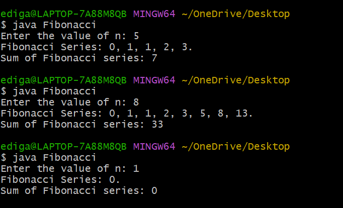

# Additional_exp2
## Title:Fibonacci numbers
## SOURCE CODE:
```java
import java.util.Scanner;

class Fibonacci {

    int n;
    int firstNumber;
    int secondNumber;
    int thirdNumber;
    int sum;

    // Constructor
    Fibonacci(int number) {
        n = number;
        firstNumber = 0;
        secondNumber = 1;
        thirdNumber = 0;
        sum = 0;
    }

    // Method to generate Fibonacci series and sum
    void generate() {
        System.out.print("Fibonacci Series: ");

        int count = n;   // to preserve original n

        while (n > 0) {
            sum += firstNumber;

            if (n == 1) {
                System.out.print(firstNumber + ".");
            } else {
                System.out.print(firstNumber + ", ");
            }

            thirdNumber = firstNumber + secondNumber;
            firstNumber = secondNumber;
            secondNumber = thirdNumber;

            n--;
        }

        System.out.println("\nSum of Fibonacci series: " + sum);
    }

    // Main method
    public static void main(String[] args) {
        Scanner sc = new Scanner(System.in);

        System.out.print("Enter the value of n: ");
        int number = sc.nextInt();

        Fibonacci f = new Fibonacci(number);
        f.generate();
    }
}
```
# OUTPUT:

