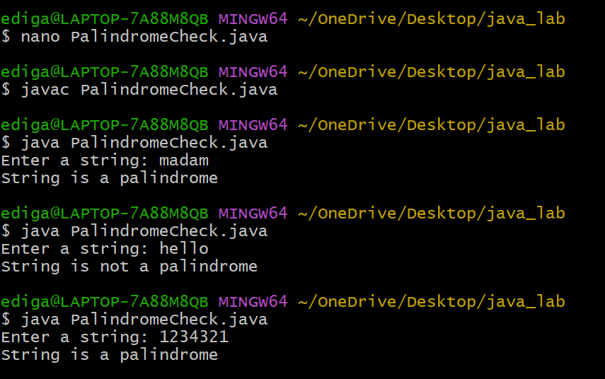

# Additional_exp3
## Title:To determine if a string is palindrome or not
## Source code:
``` java
  import java.util.Scanner;
public class PalindromeCheck {
    public static void main(String[] args) {
        Scanner sc = new Scanner(System.in);
        System.out.print("Enter a string: ");
        String str = sc.nextLine();
        int start = 0;
        int end = str.length() - 1;
        boolean isPalindrome = true;
        while (start < end) {
          if (str.charAt(start) != str.charAt(end)) {
             isPalindrome = false;
             break;
            }
          start++;
          end--;
        }
        if (isPalindrome) {
            System.out.println("String is a palindrome");
        }
        else {
            System.out.println("String is not a palindrome");
        }
        sc.close();
    }
}
```
## output:

