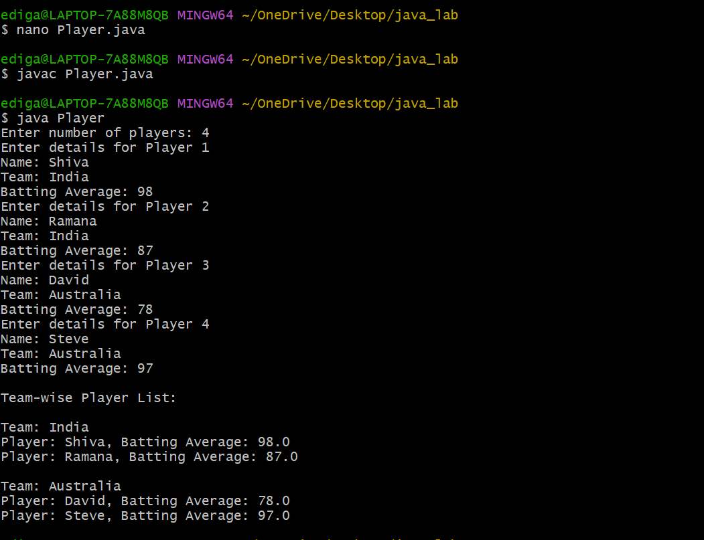

# Additional Experiment-5
## 5.Java program to read information about Players
## Source Code:
``` java
import java.util.Scanner;
class Cricket {
    String playerName;
    String teamName;
    double battingAverage;
  // Constructor
    Cricket(String playerName, String teamName, double battingAverage) {
        this.playerName = playerName;
        this.teamName = teamName;
        this.battingAverage = battingAverage;
    }
    // Method to display player details
    void display() {
        System.out.println("Player: " + playerName + 
                           ", Batting Average: " + battingAverage);
    }
}
public class Player {
    public static void main(String[] args) {
        Scanner sc = new Scanner(System.in);
        // Input number of players
        System.out.print("Enter number of players: ");
        int n = sc.nextInt();
        sc.nextLine(); // Consume newline
        // Declare array of Cricket objects
        Cricket[] players = new Cricket[n];
        // Read player details
        for (int i = 0; i < n; i++) {
            System.out.println("Enter details for Player " + (i + 1));
            System.out.print("Name: ");
            String name = sc.nextLine();
            System.out.print("Team: ");
            String team = sc.nextLine();
            System.out.print("Batting Average: ");
            double avg = sc.nextDouble();
            sc.nextLine(); // Consume newline
            players[i] = new Cricket(name, team, avg);
        }
        // Generate team-wise list
        System.out.println("\nTeam-wise Player List:");
        for (int i = 0; i < n; i++) {
            boolean teamPrinted = false;
            // Check if this team is already printed
            for (int k = 0; k < i; k++) {
                if (players[i].teamName.equalsIgnoreCase(players[k].teamName)) {
                    teamPrinted = true;
                    break;
                }
            }
            // If team not printed yet, print team and its players
            if (!teamPrinted) {
                System.out.println("\nTeam: " + players[i].teamName);
                for (int j = 0; j < n; j++) {
                    if (players[j].teamName.equalsIgnoreCase(players[i].teamName)) {
                        players[j].display();
                    }
                }
            }
        }
        sc.close();
    }
}
```
## output:

