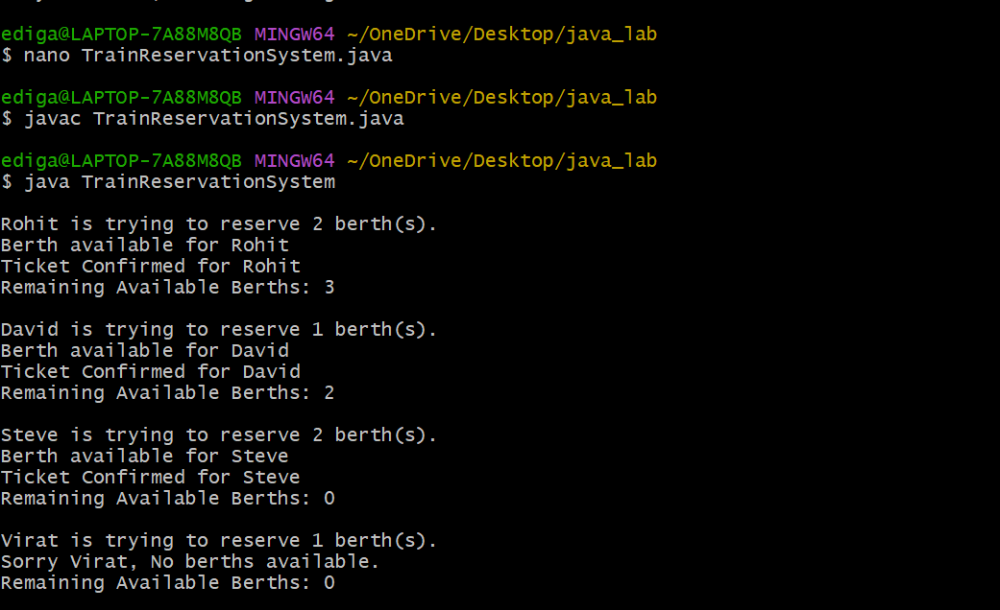

# Experiment-11
## 11.Program using Threads of following Casestudy of Train Reservation System
## Source Code:
``` java
class Reservation {
    private int availableBerths;

    // Constructor
    Reservation(int berths) {
        this.availableBerths = berths;
    }

    // Synchronized method for booking
    public synchronized void reserveBerth(String personName, int requestedBerths) {
        System.out.println("\n" + personName + " is trying to reserve " 
                           + requestedBerths + " berth(s).");

        if (requestedBerths <= availableBerths) {
            System.out.println("Berth available for " + personName);
            availableBerths -= requestedBerths;
            System.out.println("Ticket Confirmed for " + personName);
            System.out.println("Remaining Available Berths: " + availableBerths);
        } else {
            System.out.println("Sorry " + personName + 
                               ", No berths available.");
            System.out.println("Remaining Available Berths: " + availableBerths);
        }
    }
}

// Person class extending Thread
class Person extends Thread {
    private Reservation reservation;
    private int requestedBerths;

    Person(Reservation reservation, String name, int requestedBerths) {
        super(name);
        this.reservation = reservation;
        this.requestedBerths = requestedBerths;
    }

    public void run() {
        reservation.reserveBerth(getName(), requestedBerths);
    }
}

// Main class
public class TrainReservationSystem {
    public static void main(String[] args) {

        // Total available berths
        Reservation reservation = new Reservation(5);

        // Creating multiple persons (threads)
        Person p1 = new Person(reservation, "Rohit", 2);
        Person p2 = new Person(reservation, "Virat", 1);
        Person p3 = new Person(reservation, "Steve", 2);
        Person p4 = new Person(reservation, "David", 1);

        // Starting threads
        p1.start();
        p2.start();
        p3.start();
        p4.start();
    }
}
```
## output:

