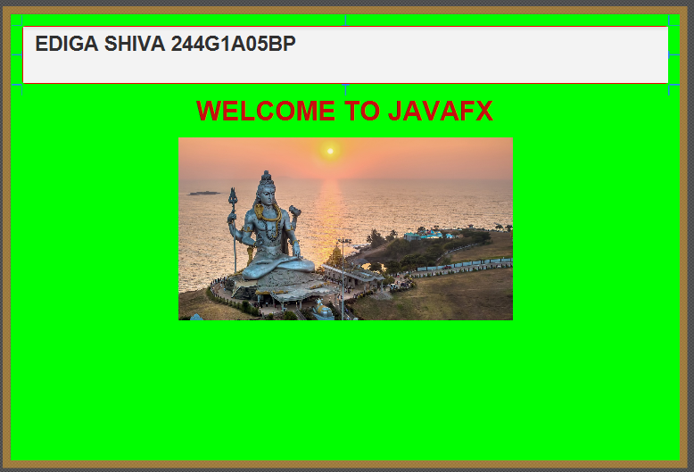

# EXPERIMENT-10
## 10.A. Without writing any code, build a GUI that display text in label and imagein an Image View (use JavaFX).
## Source Code:
``` java
<?xml version="1.0" encoding="UTF-8"?>

<?import javafx.geometry.Insets?>
<?import javafx.scene.control.Label?>
<?import javafx.scene.image.Image?>
<?import javafx.scene.image.ImageView?>
<?import javafx.scene.layout.VBox?>
<?import javafx.scene.text.Font?>

<VBox alignment="CENTER" spacing="10" xmlns:fx="http://javafx.com/fxml">
    
    <padding>
        <Insets top="10" right="10" bottom="10" left="10"/>
    </padding>

    <!-- Label to display text -->
    <Label text="Welcome to JavaFX" wrapText="true">
        <font>
            <Font size="20"/>
        </font>
    </Label>

    <!-- ImageView to display image -->
    <ImageView fitWidth="400" fitHeight="300" preserveRatio="true" smooth="true">
        <image>
            <Image url="@images/sample.jpg"/>
        </image>
    </ImageView>

</VBox>
```
## Steps:
```
Step 1: Create a new FXML document or open your GUI editor and choose a root
layout.
Choose a VBox (vertical box) to stack the text label above the image.
Step 2: Set properties on the VBox container.

Set spacing between children (for example 10 px), padding around the edges (for ex-
ample 10 px), and alignment to CENTER so children are centered horizontally.

Step 3: Add a Label as the first child of the VBox.
Enter the text you want displayed (for example: “Welcome to JavaFX”) and enable text
wrapping if needed.
Step 4: Configure the Label’s visual properties.
Set font size and weight (e.g., larger, bold font), alignment to center, and an optional
style class or inline style for color and spacing.
Step 5: Add an ImageView as the second child of the VBox.
Select the ImageView component from the library and drop it below the Label.
Step 6: Assign an image resource to the ImageView.

Choose an image file stored in your project resources (recommended folder: re-
sources/images/). Use a relative path so the FXML remains portable.

Step 7: Set sizing and scaling behavior for the ImageView.
Specify fitWidth and/or fitHeight (for example 400 × 300), enable preserveRatio = true
to maintain aspect ratio, and enable smooth = true for better scaling quality.
Step 8: Optionally set VBox.vgrow or other layout constraints.
If you want the image to expand when the window grows, set the ImageView’s vertical
grow to ALWAYS; otherwise leave default to keep fixed-size behavior.
Step 9: (Optional) Add fx:id values for the Label and ImageView.
If future code interaction is possible, assign fx:id="myLabel" and
fx:id="myImageView"; otherwise skip this step.
Step 10: (Optional) Link a stylesheet for consistent styling.
Add a CSS file to the project, reference it in the FXML document, and assign style
classes (for example .title-label) to the Label.
Step 11: Preview the layout in Scene Builder or the FXML editor.
Check that the text is readable, the image displays correctly, and resizing behaves as
expected.
Step 12: Save the FXML file and image resource in the project’s resources folder.
Confirm that the image path used by the ImageView is correct relative to the FXML
file.
Step 13: Document resource locations and any styling choices.
Write a short README note indicating where the image and FXML are saved and what
CSS (if any) is used.
Step 14: Hand off the FXML and resources for integration into a JavaFX application.
If someone later needs to load the UI from Java, they can use FXMLLoader to load the
saved FXML file.
```
## output:


## 10.B. To design a JavaFX-based Tip Calculator application that calculates the tip
## Source Code:
``` java
import javafx.application.Application;
import javafx.geometry.Pos;
import javafx.scene.Scene;
import javafx.scene.control.*;
import javafx.scene.layout.GridPane;
import javafx.stage.Stage;

public class TipCalculator extends Application {

    @Override
    public void start(Stage stage) {

        // Labels
        Label billLabel = new Label("Enter Bill Amount:");
        Label tipLabel = new Label("Select Tip Percentage:");
        Label tipResult = new Label("Tip Amount: ");
        Label totalResult = new Label("Total Bill: ");

        // TextField for bill amount
        TextField billField = new TextField();

        // Radio Buttons for tip percentage
        RadioButton tip10 = new RadioButton("10%");
        RadioButton tip15 = new RadioButton("15%");
        RadioButton tip20 = new RadioButton("20%");

        ToggleGroup group = new ToggleGroup();
        tip10.setToggleGroup(group);
        tip15.setToggleGroup(group);
        tip20.setToggleGroup(group);

        // CheckBox for rounding
        CheckBox roundCheck = new CheckBox("Round Tip");

        // Button
        Button calculateBtn = new Button("Calculate Tip");

        // Layout
        GridPane root = new GridPane();
        root.setAlignment(Pos.CENTER);
        root.setHgap(10);
        root.setVgap(10);

        root.add(billLabel, 0, 0);
        root.add(billField, 1, 0);
        root.add(tipLabel, 0, 1);
        root.add(tip10, 1, 1);
        root.add(tip15, 1, 2);
        root.add(tip20, 1, 3);
        root.add(roundCheck, 1, 4);
        root.add(calculateBtn, 1, 5);
        root.add(tipResult, 1, 6);
        root.add(totalResult, 1, 7);

        // Event Handling
        calculateBtn.setOnAction(e -> {

            double bill = Double.parseDouble(billField.getText());
            double tipPercent = 0;

            if (tip10.isSelected())
                tipPercent = 10;
            else if (tip15.isSelected())
                tipPercent = 15;
            else if (tip20.isSelected())
                tipPercent = 20;

            double tip = bill * tipPercent / 100;

            if (roundCheck.isSelected())
                tip = Math.round(tip);

            double total = bill + tip;

            tipResult.setText("Tip Amount: " + tip);
            totalResult.setText("Total Bill: " + total);
        });

        Scene scene = new Scene(root, 350, 350);
        stage.setTitle("Tip Calculator");
        stage.setScene(scene);
        stage.show();
    }

    public static void main(String[] args) {
        launch(args);
    }
}
```
## Steps:
```
Step 1: Create a new JavaFX Application class.
Step 2: Define the start() method where the GUI will be created.
Step 3: Create a Label and TextField to input the bill amount.
Step 4: Create GUI components to select a tip percentage:
● Use RadioButtons grouped with a ToggleGroup, or
● Use a Slider or ChoiceBox with tip percentage options.
Step 5: (Optional) Create a CheckBox for rounding the tip to the nearest whole number.
Step 6: Create a Button labeled “Calculate Tip”.
Step 7: Create Labels to display the calculated tip amount and total bill.
Step 8: Arrange all components in a layout container, such as VBox or GridPane, with
proper spacing and alignment.
Step 9: Add an event handler for the “Calculate Tip” button:
● Read the bill amount from the TextField.
● Read the selected tip percentage.
● Calculate the tip amount (billAmount × tipPercentage / 100).
● If rounding is selected, round the tip amount.
● Calculate the total bill (billAmount + tipAmount).
● Display the tip and total in the corresponding labels.
Step 10: Set up the Scene with the layout container and attach it to the Stage.
Step 11: Set the stage title and size.
Step 12: Show the stage to display the GUI to the user.
Step 13: End the program once the user closes the window.
```
## output:

