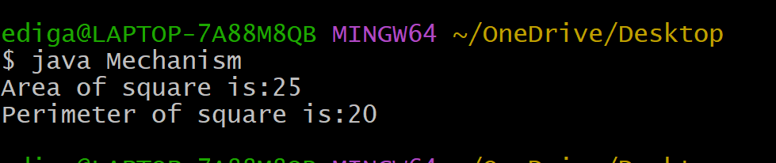
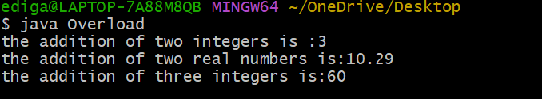
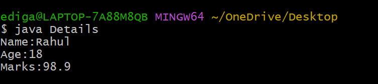

# Experiment_2a
## Title:impliment ofmechanism of class
## course code:
```java
class Square {
    int area(int side) {
        return side * side;
    }
    int perimeter(int side) {
        return 4 * side;
    }
    public static void main(String[] args) {
        Square sq = new Square();
        int side = 5;
        int area = sq.area(side);
        int perimeter = sq.perimeter(side);
        System.out.println("Side of square: " + side);
        System.out.println("Area of square: " + area);
        System.out.println("Perimeter of square: " + perimeter);
    }
}
```
# output:


# Experiment_2b
## Title:Impliment method of Overload
## coursecode:
```java
class Add {
   int add1(int a,int b) {
   return a+b;
   }
   double add2(double a,double b) {
   return a+b;
   }
   int add3(int a,int b,int c) {
   return a+b+c;
   }
}
class Overload {
  public static void main(String[] args) {
   Add obj=new Add();
   System.out.println("the addition of two integers is :"+obj.add1(1,2));
   System.out.println("the addition of two real numbers is:"+obj.add2(2.45,7.84));
   System.out.println("the addition of three integers is:"+obj.add3(10,20,30));
  }
}
```
# output:


# Experiment_2c
## Title:Impliment Constructer
## Source code:
```java
class Student {
  String name;
  int age;
  double marks;
  Student(String n,int a,double m) {
     name=n;
     age=a;
     marks=m;
  }

  void display() {
     System.out.println("Name:"+name);
     System.out.println("Age:"+age);
     System.out.println("Marks:"+marks);
  }
}
class Details {
    public static void main(String[] args) {
       Student std=new Student("Rahul",18,98.9);
          std.display();
   }
}
```
# output:


