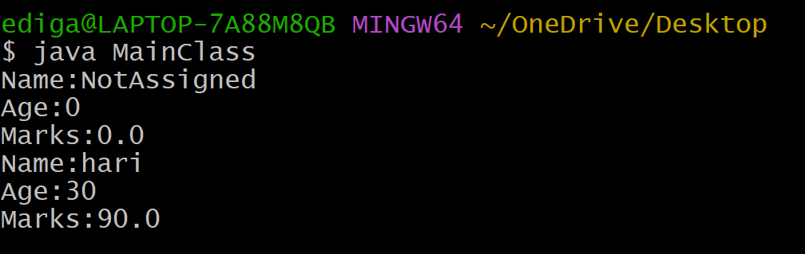
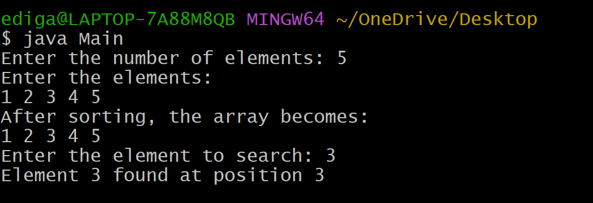
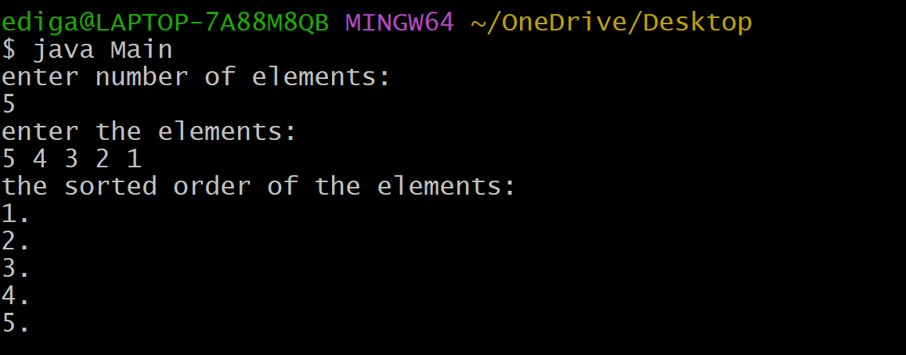

# EXPERIMENT3
## 3A.Title:Constructer Overloading
## SOURCE CODE:
``` java
class Student1 {
  String name;
  int age;
  double marks;
  Student1() {
  name="NotAssigned";
  age=0;
  marks=0.0;
 }
  Student1(String name,int age,double marks) {
  this.name=name;
  this.age=age;
  this.marks=marks;
 }
void display() {
System.out.println("Name:"+this.name);
System.out.println("Age:"+this.age);
System.out.println("Marks:"+this.marks);
}
}
class MainClass {
  public static void main(String[] args) {
     Student1 std1=new Student1();
     std1.display();
     Student1 std2=new Student1("hari",30,90);
     std2.display();
    }
}
```
# OUTPUT:



# 3B.Title:BinarySearch
## SOURCE CODE:
``` java
import java.util.Scanner;

// Logic Class
class BinarySearch {

    // Method to sort array (Bubble Sort)
    void sort(int[] arr, int n) {
        for (int i = 0; i < n - 1; i++) {
            for (int j = 0; j < n - i - 1; j++) {
                if (arr[j] > arr[j + 1]) {
                    int temp = arr[j];
                    arr[j] = arr[j + 1];
                    arr[j + 1] = temp;
                }
            }
        }
    }

    // Method to perform Binary Search
    int search(int[] arr, int n, int key) {
        int low = 0;
        int high = n - 1;

        while (low <= high) {
            int mid = (low + high) / 2;

            if (arr[mid] == key) {
                return mid + 1; // 1-based position
            } else if (arr[mid] < key) {
                low = mid + 1;
            } else {
                high = mid - 1;
            }
        }
        return -1; // Element not found
    }

    // Display array
    void display(int[] arr, int n) {
        for (int i = 0; i < n; i++) {
            System.out.print(arr[i] + " ");
        }
        System.out.println();
    }
}

// Main Class
class Main {

    public static void main(String[] args) {
        Scanner sc = new Scanner(System.in);

        // Input number of elements
        System.out.print("Enter the number of elements: ");
        int n = sc.nextInt();

        int[] arr = new int[n];

        // Input elements
        System.out.println("Enter the elements:");
        for (int i = 0; i < n; i++) {
            arr[i] = sc.nextInt();
        }

        BinarySearch bs = new BinarySearch();

        // Sort the array
        bs.sort(arr, n);

        System.out.println("After sorting, the array becomes:");
        bs.display(arr, n);

        // Input key element
        System.out.print("Enter the element to search: ");
        int key = sc.nextInt();

        // Search element
        int result = bs.search(arr, n, key);

        if (result != -1) {
            System.out.println("Element " + key + " found at position " + result);
        } else {
            System.out.println("Element " + key + " not found in the list");
        }

        sc.close();
    }
}
```
# OUTPUT:


# 3C.Title:BubbleSort
## SOURCE CODE:
```java
import java.util.Scanner;
class BubbleSort {
  int arr[];
  int n;
  void Sort(int arr[],int n) {
  for(int i=0;i<n-1;i++) {
    for(int j=0;j<n-i-1;j++) {
      if(arr[j]>arr[j+1]) {
         int temp=arr[j];
         arr[j]=arr[j+1];
         arr[j+1]=temp;
       }
      }
     }
}
void display(int arr[],int n) {
System.out.println("the sorted order of the elements:");
for(int i=0;i<n;i++)
  System.out.println(arr[i]+".");
}
}
import java.util.Scanner;
class Main {
  public static void main(String[] args) {
    Scanner sc=new Scanner(System.in);
    System.out.println("enter number of elements:");
    int n=sc.nextInt();
    int[]arr=new int[n];
    System.out.println("enter the elements:");
     for(int i=0;i<n;i++) {
      arr[i]=sc.nextInt();
     } 
    BubbleSort bs=new BubbleSort();
    bs.Sort(arr,n);
    bs.display(arr,n);
    sc.close();
   }
}
```
## OUTPUT:

