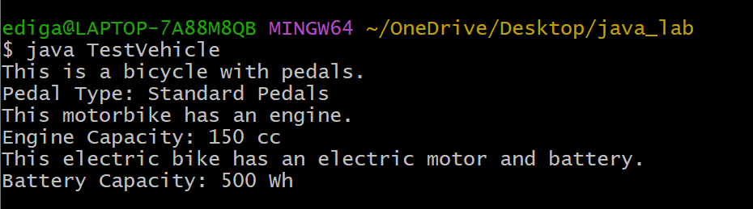
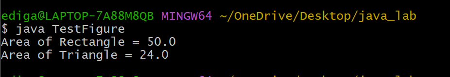

# EXPERIMENT-4
## 4.A. To impliment Single inheritance
## Source code:
``` java
public class Person {
    String name;
    int age;
    public Person(String name, int age) {
        this.name = name;
        this.age = age;
    }
    public void displayPersonDetails() {
        System.out.println("Name : " + name);
        System.out.println("Age  : " + age);
    }
}
public class Employee extends Person {
    double annualSalary;
    int yearOfJoining;
    String nationalInsuranceNumber;
    public Employee(String name, int age, double annualSalary, int yearOfJoining, String nationalInsuranceNumber) {
        super(name, age);
        this.annualSalary = annualSalary;
        this.yearOfJoining = yearOfJoining;
        this.nationalInsuranceNumber = nationalInsuranceNumber;
    }
    public void displayEmployeeDetails() {
        displayPersonDetails();
        System.out.println("Annual Salary : " + annualSalary);
        System.out.println("Year of Joining : " + yearOfJoining);
        System.out.println("National Insurance Number : " + nationalInsuranceNumber);
    }
}
public class TestEmployee {
    public static void main(String[] args) {
        Employee emp1 = new Employee( "Rahul Sharma",28,550000.00,2022,"NI12345A");
        emp1.displayEmployeeDetails();
    }
}
```
# output:


## 4.B. To implement Multi-level Inheritance
## source code:
``` java
// Base class
class Bicycle {
    String pedalType;
    void showBicycleInfo() {
        System.out.println("This is a bicycle with pedals.");
        System.out.println("Pedal Type: " + pedalType);
    }
}
class Motorbike extends Bicycle {
    int engineCapacity;
    void showMotorbikeInfo() {
        System.out.println("This motorbike has an engine.");
        System.out.println("Engine Capacity: " + engineCapacity + " cc");
    }
}
class ElectricBike extends Motorbike {
    int batteryCapacity;
    void showElectricBikeInfo() {
        System.out.println("This electric bike has an electric motor and battery.");
        System.out.println("Battery Capacity: " + batteryCapacity + " Wh");
    }
}
public class TestVehicle {
    public static void main(String[] args) {
        ElectricBike eBike = new ElectricBike();
        eBike.pedalType = "Standard Pedals";
        eBike.engineCapacity = 150;
        eBike.batteryCapacity = 500;
        eBike.showBicycleInfo();       
        eBike.showMotorbikeInfo();     
        eBike.showElectricBikeInfo();
    }
}
```
## output:


## 4.C. Construct abstract class
## source code:
``` java
// Abstract class
abstract class Figure {
    double dim1, dim2;
    Figure(double d1, double d2) {
        dim1 = d1;
        dim2 = d2;
    }
    abstract double area();
}
class Rectangle extends Figure {
    Rectangle(double length, double breadth) {
        super(length, breadth);
    }
    double area() {
        return dim1 * dim2;
    }
}
class Triangle extends Figure {
    Triangle(double base, double height) {
        super(base, height);
    }
    double area() {
        return 0.5 * dim1 * dim2;
    }
}
// Main class
public class TestFigure {
    public static void main(String[] args) {
        Figure f1 = new Rectangle(10, 5);
        System.out.println("Area of Rectangle = " + f1.area());
        Figure f2 = new Triangle(8, 6);
        System.out.println("Area of Triangle = " + f2.area());
    }
}
```
## output:

