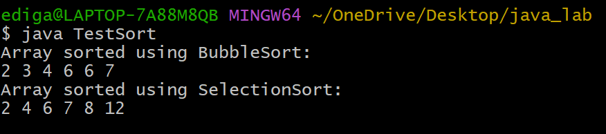
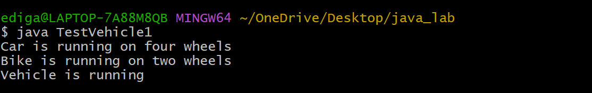
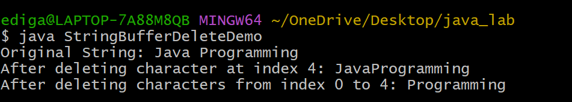

# EXPERIMENT-5
## 5A.Implement Interface
## source code:
``` java
interface Sortable {
   void sort(int[] arr);
}
class BubbleSort implements Sortable {
    public void sort(int[] arr) {
        int n = arr.length;
        for(int i=0;i< n-1;i++) {
        for(int j = 0; j <n-i-1;j++) {
        if(arr[j] > arr[j + 1]) {
          int temp = arr[j];
          arr[j] = arr[j + 1];
          arr[j + 1] = temp;
         }
       }
     }
   }
}
class SelectionSort implements Sortable {
    public void sort(int[] arr) {
       int n = arr.length;
       for (int i = 0; i < n - 1; i++) {
       int minIndex = i;
       for (int j = i + 1; j < n; j++) {
       if (arr[j] < arr[minIndex]) {
          minIndex = j;
       }
     }
            // swap
       int temp = arr[i];
       arr[i] = arr[minIndex];
        arr[minIndex] = temp;
      }
    }
}
public class TestSort {
    static void printArray(int[] arr) {
        for (int num : arr) {
        System.out.print(num + " ");
        }
        System.out.println();
    }
    public static void main(String[] args) {
        int[] arr1 = {2,6,7,3,4,6};
        Sortable ref;
        ref = new BubbleSort();
        ref.sort(arr1);
        System.out.println("Array sorted using BubbleSort:");
        printArray(arr1);
        int[] arr2 = {8,4,2,6,12,7};
        ref = new SelectionSort();
        ref.sort(arr2);
        System.out.println("Array sorted using SelectionSort:");
        printArray(arr2);
    }
}
```
## output:


## 5B.Implement Runtime Polymorphism
## source code:
``` java
class Vehicle {
    void run() {
        System.out.println("Vehicle is running");
    }

}
class Car extends Vehicle {
    void run() {
        System.out.println("Car is running on four wheels");
    }
}
class Bike extends Vehicle {
    void run() {
        System.out.println("Bike is running on two wheels");
    }
}
public class TestVehicle1 {
    public static void main(String[] args) {
        Vehicle v;
        v = new Car();
        v.run();
        v = new Bike();
        v.run();
        v = new Vehicle();
        v.run();
    }
}
```
## output:


## 5C.StringBuffer -delete and remove charecters
## source code:
``` java
public class StringBufferDeleteDemo {
    public static void main(String[] args) {
        StringBuffer sb = new StringBuffer("Java Programming");
        System.out.println("Original String: " + sb);
        sb.deleteCharAt(4);
        System.out.println("After deleting character at index 4: " + sb);
        sb.delete(0, 4);
        System.out.println("After deleting characters from index 0 to 4: " + sb);
    }
}
```
## output:


