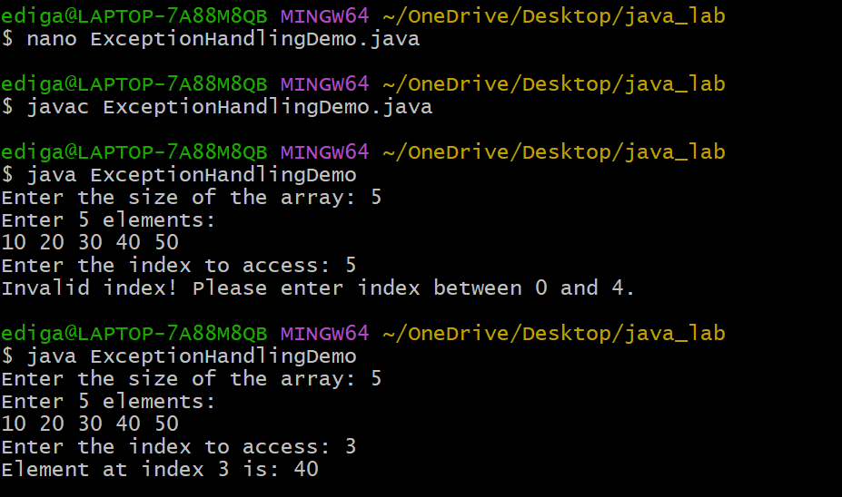
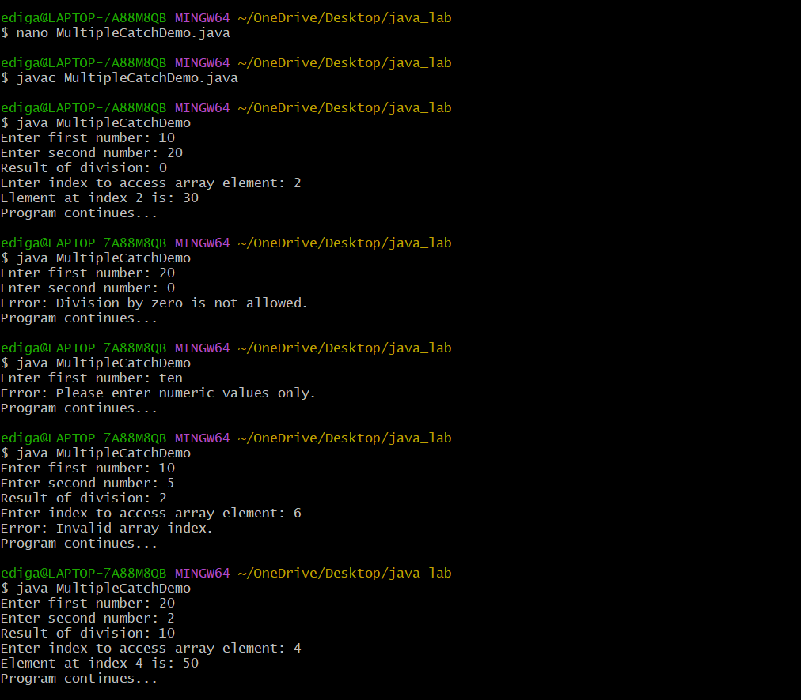
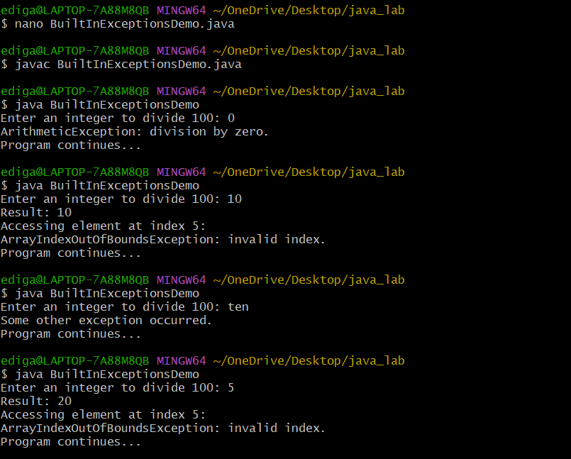

# EXPERIMENT-6
## 6.A.To implement exception handling mechanism
## Source code:
``` java
import java.util.Scanner;
class ExceptionHandling {
public static void main(String[] args) {
Scanner sc=new Scanner(System.in);
System.out.print("Enter the size of array:");
int n=sc.nextInt();
int[] arr=new int[n];
System.out.print("enter the index"+n+"elements");
for(int i=0;i<n;i++) {
arr[i]=sc.nextInt();
}
System.out.print("Enter an index to access:");
int index=sc.nextInt();
try {
System.out.println("Element at index+index+is:"+arr[index]);
}
catch(ArrayIndexOutOfBoundException e) {
System.out.println("Invalid index!please enter index between 0 to n-1");
}
sc.close();
}
}
```
## output:


## 6.B.Illustrating Multiple catch clauses
## Source code:
``` java
import java.util.Scanner;
import java.util.InputMismatchException;
public class MultipleCatchDemo {
    public static void main(String[] args) {
        Scanner sc = new Scanner(System.in);
        int[] arr = {10, 20, 30, 40, 50};
        try {
            System.out.print("Enter first number: ");
            int a = sc.nextInt();
            System.out.print("Enter second number: ");
            int b = sc.nextInt();
            int result = a / b;
            System.out.println("Result of division: " + result);
            System.out.print("Enter index to access array element: ");
            int index = sc.nextInt();
            System.out.println("Element at index " + index + " is: " + arr[index]);
        }
        catch (ArithmeticException e) {
            System.out.println("Error: Division by zero is not allowed.");
        }
        catch (InputMismatchException e) {
            System.out.println("Error: Please enter numeric values only.");
        }
        catch (ArrayIndexOutOfBoundsException e) {
            System.out.println("Error: Invalid array index.");
        }
        catch (Exception e) {
            System.out.println("Some other error occurred.");
        }
        System.out.println("Program continues...");
        sc.close();
    }
}
```
## output:


## 6.C. Creation of java Built in Exception
## Source code:
``` java
import java.util.Scanner;
public class BuiltInExceptionsDemo {
    public static void main(String[] args) {
        Scanner sc = new Scanner(System.in);
        try {
            System.out.print("Enter an integer to divide 100: ");
            int n = sc.nextInt();
            int result = 100 / n;
            System.out.println("Result: " + result);
            int[] arr = new int[3];
            System.out.println("Accessing element at index 5:");
            System.out.println(arr[5]);
            sc.nextLine();
            System.out.print("Enter a number as text: ");
            String s = sc.nextLine();
            int num = Integer.parseInt(s);
            System.out.println("Converted number: " + num);
        }
        catch (ArithmeticException e) {
            System.out.println("ArithmeticException: division by zero.");
        }
        catch (ArrayIndexOutOfBoundsException e) {
            System.out.println("ArrayIndexOutOfBoundsException: invalid index.");
        }
        catch (NumberFormatException e) {
            System.out.println("NumberFormatException: invalid numeric format.");
        }
        catch (Exception e) {
            System.out.println("Some other exception occurred.");
        }

        System.out.println("Program continues...");
        sc.close();
    }
}
```
## output:

