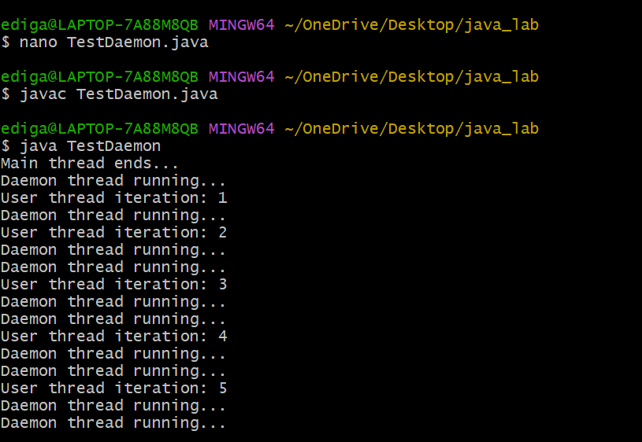
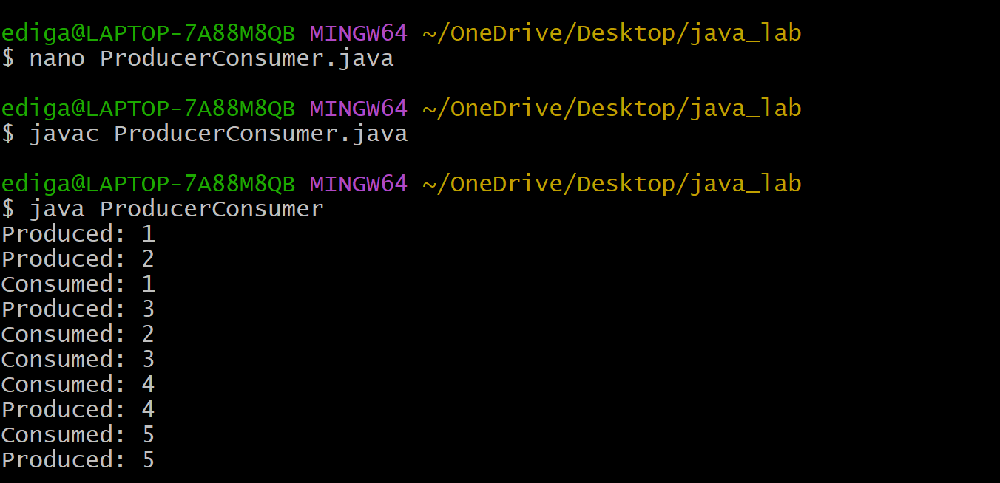
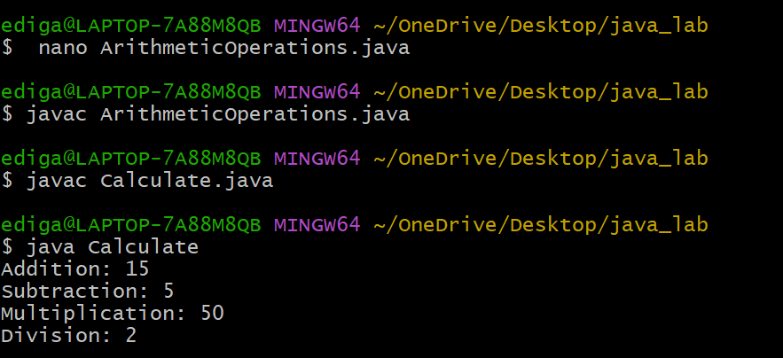

# EXPERIMENT-8
## 8.A. Illustrating Daemon Threads
## Source Code:
``` java
class DaemonThread extends Thread {
    public void run() {
        try {
            while (true) {
                System.out.println("Daemon thread running...");
                Thread.sleep(500);
            }
        } catch (InterruptedException e) {
            System.out.println("Daemon thread interrupted");
        }
    }
}
class UserThread extends Thread {
    public void run() {
        try {
            for (int i = 1; i <= 5; i++) {
                System.out.println("User thread iteration: " + i);
                Thread.sleep(1000);
            }
        } catch (InterruptedException e) {
            System.out.println("User thread interrupted");
        }
    }
}
public class TestDaemon {
    public static void main(String[] args) {
        UserThread ut = new UserThread();
        DaemonThread dt = new DaemonThread();
        dt.setDaemon(true);
        ut.start();
        dt.start();
        System.out.println("Main thread ends...");
    }
}
```
## output:


## 8.B.Implements Producer Consumer problem using ITC
## Source Code:
``` java
class SharedBuffer {
    int[] buffer;
    int count = 0;
    int in = 0;
    int out = 0;
    SharedBuffer(int size) {
        buffer = new int[size];
    }
    synchronized void produce(int item) throws InterruptedException {
        while (count == buffer.length) {
            wait();
        }
        buffer[in] = item;
        in = (in + 1) % buffer.length;
        count++;
        notify();
    }
    synchronized int consume() throws InterruptedException {
        while (count == 0) {
            wait();
        }
        int item = buffer[out];
        out = (out + 1) % buffer.length;
        count--;
        notify();
        return item;
    }
}
class Producer extends Thread {
    private SharedBuffer buffer;
    Producer(SharedBuffer buffer) {
        this.buffer = buffer;
    }
    public void run() {
        try {
            for (int i = 1; i <= 5; i++) {
                buffer.produce(i);
                System.out.println("Produced: " + i);
            }
        } catch (InterruptedException e) {
            e.printStackTrace();
        }
    }
}
class Consumer extends Thread {
    private SharedBuffer buffer;
    Consumer(SharedBuffer buffer) {
        this.buffer = buffer;
    }
    public void run() {
        try {
            for (int i = 1; i <= 5; i++) {
                int item = buffer.consume();
                System.out.println("Consumed: " + item);
            }
        } catch (InterruptedException e) {
            e.printStackTrace();
        }
    }
}

// Main Class
public class ProducerConsumer {
    public static void main(String[] args) {
        SharedBuffer buffer = new SharedBuffer(5);
        Producer p = new Producer(buffer);
        Consumer c = new Consumer(buffer);
        p.start();
        c.start();
    }
}
```
## output:


## 8.C.Import and use the user defined packages
## Source Code:
## class arithmetic
``` java
package arithmetic;
public class ArithmeticOperations {

  // Method for addition
    public int addition(int x, int y) {
        return x + y;
    }

    // Method for subtraction
    public int subtraction(int x, int y) {
        return x - y;
    }

    // Method for multiplication
    public int multiplication(int x, int y) {
        return x * y;
    }

    // Method for division
    public int division(int x, int y) {
        return x / y;
    }
}
```
## class calculate
``` java
import arithmetic.*;
public class Calculate {
    public static void main(String[] args) {
        ArithmeticOperations ao = new ArithmeticOperations();
        int sum = ao.addition(10, 5);
        System.out.println("Addition: " + sum);
        int diff = ao.subtraction(10, 5);
        System.out.println("Subtraction: " + diff);
        int prod = ao.multiplication(10, 5);
        System.out.println("Multiplication: " + prod);
        int quot = ao.division(10, 5);
        System.out.println("Division: " + quot);
    }
}
```
## output:

