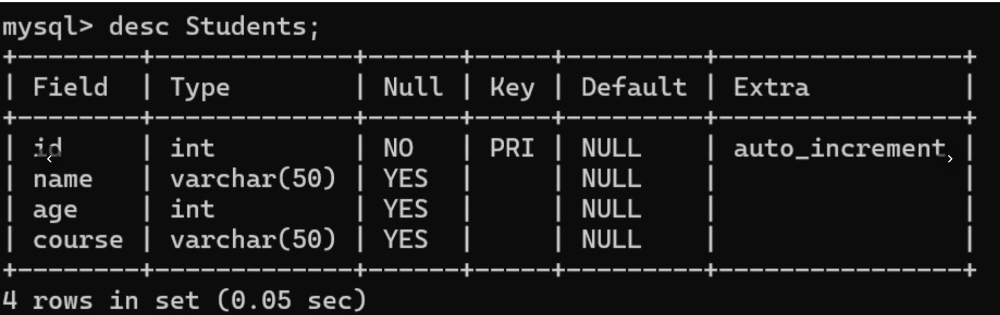
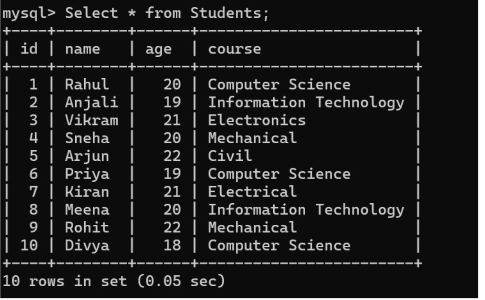
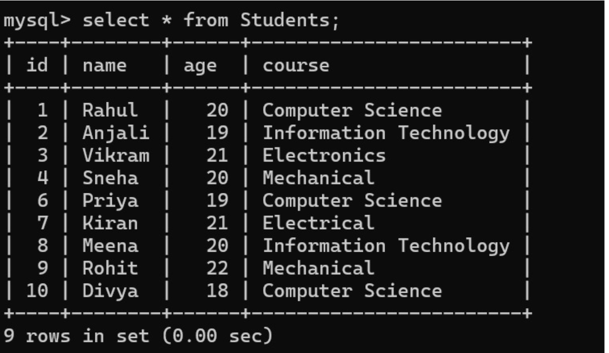

# Experiment-9
## 9.A .Connects to a database using JDBC
## Sourcecode:
``` java
import java.sql.Connection;
import java.sql.DriverManager;
import java.sql.PreparedStatement;
import java.sql.ResultSet;
import java.sql.SQLException;

public class DatabaseConnectionExample {

    public static void main(String[] args) {

        // Step 1: Database connection details
        String url = "jdbc:oracle:thin:@localhost:1521:Shiva";
        String username = "root";
        String password = "Password";

        // Step 2: SQL Query
        String query = "SELECT * FROM student";

        try {
            // Step 3: Load Oracle JDBC Driver
            Class.forName("oracle.jdbc.driver.OracleDriver");

            // Step 4: Establish Connection
            Connection con = DriverManager.getConnection(url, username, password);
            System.out.println("Connected to Oracle Database Successfully!");

            // Step 5: Prepare SQL Statement
            PreparedStatement ps = con.prepareStatement(query);

            // Step 6: Execute Query
            ResultSet rs = ps.executeQuery();

            // Step 7: Process ResultSet
            System.out.println("Student Details:");
            while (rs.next()) {
                int id = rs.getInt(1);
                String name = rs.getString(2);
                int age = rs.getInt(3);

                System.out.println("ID: " + id + " Name: " + name + " Age: " + age);
            }

            // Step 8: Close Resources
            rs.close();
            ps.close();
            con.close();

            System.out.println("Database operations completed successfully.");

        } catch (ClassNotFoundException e) {
            System.out.println("Oracle JDBC Driver not found.");
            e.printStackTrace();

        } catch (SQLException e) {
            System.out.println("Database connection error.");
            e.printStackTrace();
        }
    }
}
```
## output:


## 9.B. Connect database and Insert values into it
## Source code:
``` java
import java.sql.Connection;
import java.sql.DriverManager;
import java.sql.Statement;

public class Insert {

    public static void main(String[] args) {

        String url = "jdbc:mysql://localhost:3306/Shiva";
        String username = "root";
        String password = "Password";   // Change to your MySQL password

        try {
            // Load Driver
            Class.forName("com.mysql.cj.jdbc.Driver");

            // Establish Connection
            Connection con = DriverManager.getConnection(url, username, password);

            // Create Statement
            Statement stmt = con.createStatement();

            // Insert 10 records in single query
            String query = "INSERT INTO students (name, age, course) VALUES "
                    + "('Rahul', 20, 'Computer Science'),"
                    + "('Anjali', 19, 'Information Technology'),"
                    + "('Vikram', 21, 'Electronics'),"
                    + "('Sneha', 20, 'Mechanical'),"
                    + "('Arjun', 22, 'Civil'),"
                    + "('Priya', 19, 'Computer Science'),"
                    + "('Kiran', 21, 'Electrical'),"
                    + "('Meena', 20, 'Information Technology'),"
                    + "('Rohit', 22, 'Mechanical'),"
                    + "('Divya', 18, 'Computer Science')";

            // Execute Query
            int rows = stmt.executeUpdate(query);

            System.out.println(rows + " records inserted successfully!");

            // Close Connection
            stmt.close();
            con.close();

        } catch (Exception e) {
            System.out.println(e);
        }
    }
}
```
## output:


## 9.C.Connects database and delete values from it
## Source code:
``` java
import java.sql.Connection;
import java.sql.DriverManager;
import java.sql.Statement;

public class DeleteStudent {

    public static void main(String[] args) {

        String url = "jdbc:mysql://localhost:3306/Shiva";
        String username = "root";
        String password = "Password";   // Change accordingly

        try {
            Class.forName("com.mysql.cj.jdbc.Driver");

            Connection con = DriverManager.getConnection(url, username, password);

            Statement stmt = con.createStatement();

            String query = "DELETE FROM students WHERE id=5";

            int rows = stmt.executeUpdate(query);

            System.out.println(rows + " record(s) deleted successfully!");

            stmt.close();
            con.close();

        } catch (Exception e) {
            System.out.println(e);
        }
    }
}
```
## output:

